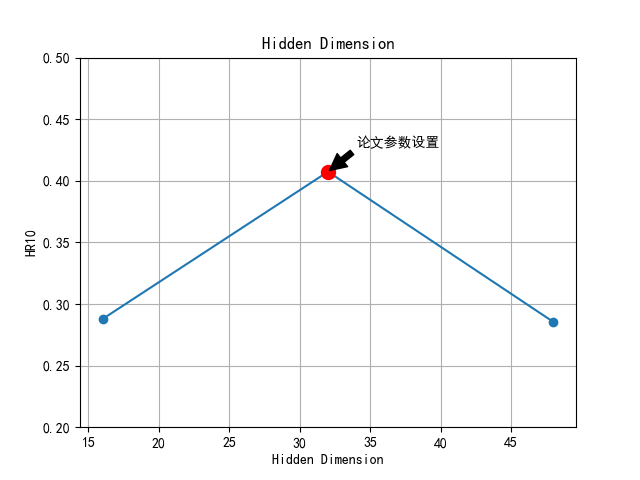
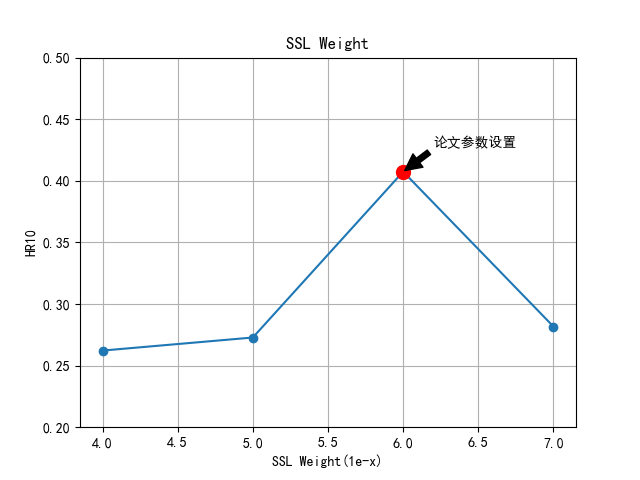

# SYSU 2023 级 机器学习大作业

本仓库为使用 ReChorus 框架对 "[SelfGNN: Self-Supervised Graph Neural Networks for Sequential Recommendation](https://arxiv.org/abs/2405.20878)"[SIGIR'2024]进行复现

本项目基于 [ReChorus](https://github.com/THUwangcy/ReChorus) 框架实现

论文原始代码仓库地址：[SelfGNN](https://github.com/HKUDS/SelfGNN)

# 相比 ReChorus 增加文件 Handler.py, SelfGNN.py 和 Runner.py

- Handler.py: src/helpers/Handler.py
- SelfGNN.py: src/models/SelfGNN.py
- Runner.py: src/helpers/Runner.py

# 1. 环境准备

## 1. 1 克隆仓库

```bash
git clone https://github.com/tyler55427/SYSU-2023-ReChorus.git
cd SYSU-2023-Rechorus
```

## 1. 2 安装依赖

```bash
conda create -n selfgnn python==3.10.4
conda activate selfgnn
pip install -r requirements.txt
```

# 2. 复现论文代码

保持论文的参数设置

## 2.1 amazon

```bash
python src/main.py --data amazon --reg 1e-2 --lr 1e-3 --temp 0.1 --ssl_reg 1e-6 --save_path amazon --epoch 150  --batch 512 --sslNum 80 --graphNum 5  --pred_num 0 --gnn_layer 3 --test True --att_layer 4 --testSize 1000 --keepRate 0.5 --sampNum 40 --pos_length 200 --regenerate 1
```

## 2.2 gowalla

```bash
python src/main.py --data gowalla --lr 2e-3 --reg 1e-2 --temp 0.1 --ssl_reg 1e-6 --save_path gowalla  --epoch 150  --batch 512 --sslNum 40 --graphNum 3  --gnn_layer 2  --att_layer 1 --test True --testSize 1000 --ssldim 48 --regenerate 1
```

## 2.3 moveilens

```bash
python src/main.py --data movielens --lr 1e-3 --reg 1e-2 --ssl_reg 1e-6 --save_path movie6 --epoch 150  --batch 512 --sampNum 40 --sslNum 90 --graphNum 6 --gnn_layer 2 --att_layer 3 --test True  --testSize 1000 --ssldim 48 --keepRate 0.5 --pos_length 200 --leaky 0.5 --regenerate 1
```

## 2.3 yelp

```bash
python src/main.py --data yelp --reg 1e-2 --temp 0.1 --ssl_reg 1e-7  --save_path yelp12 --epoch 150  --batch 512 --sslNum 40 --graphNum 12 --gnn_layer 3  --att_layer 2 --test True --testSize 1000 --ssldim 32 --sampNum 40 --regenerate 1
```

# 3. 调整参数进行实验

根据论的参数调整实验，对下列参数进行调整：

1. 将时间间隔分成多少个间隙，`graphNum` = [2, 3, 4, 5, 6, 7]  
   

2. 每个用户长期兴趣的嵌入的维度 $d_{sal}$ = [16, 32, 48]  
   

3. 用户个性化的损失 $L_{sal}$ 的权重系数 $\lambda_{1}$ = [1e-4, 1e-5, 1e-6, 1e-7]  
   

# 4. 进行消融实验

根据论文中的消融实验，对下列模块进行消融实验：

1. 短期学习：全局交互时间表
   [图像占位符]
2. 长期学习：移除基于注意力的实例级别的序列模式（-ATL）
   {:width="60%"}
3. 个性化降噪自增强：移除自增强损失（-SAL）
   {:width="60%"}

# 5. 尝试在 ReChorus 框架上的数据集进行测试

## 5.1 grocery

```bash
python main.py --data grocery --reg 1e-2 --lr 1e-3 --temp 0.1 --ssl_reg 1e-6 --save_path grocery --epoch 10  --batch 256 --sslNum 80 --graphNum 3  --pred_num 0 --gnn_layer 3 --test True --att_layer 4 --testSize 100 --keepRate 0.5 --sampNum 40 --pos_length 200 --regenerate 1
```

## 5.2 MovieLens_1M

```bash
python main.py --data ml1m --reg 1e-2 --lr 1e-3 --temp 0.1 --ssl_reg 1e-6 --save_path ml1m --epoch 100  --batch 256 --sslNum 80 --graphNum 3  --pred_num 0 --gnn_layer 3 --test True --att_layer 4 --testSize 100 --keepRate 0.5 --sampNum 40 --pos_length 200 --regenerate 1
```
